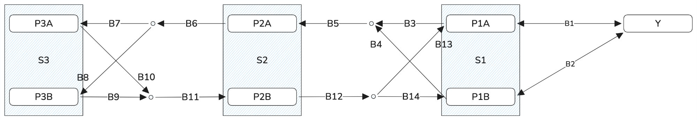

# Railway Topology

This document defines the fixed railway topology used by the assignment.

Source: the assignment track map and adjacency list.

---

## Components

### Yard

- `Y`

### Stations

- `S1`
- `S2`
- `S3`

### Platforms

- `P1A`
- `P1B`
- `P2A`
- `P2B`
- `P3A`
- `P3B`

### Blocks

- `B1` – `B14`

---

## Track Map



The adjacency list below is the authoritative representation used by the backend.

---

## Directed Connectivity

`<-->` means both directions are valid.

The assignment defines:

```text
Y <--> B1 <--> P1A
Y <--> B2 <--> P1B

P1A -> B3 -> B5 -> P2A
P1B -> B4 -> B5 -> P2A

P2A -> B6 -> B7 -> P3A
P2A -> B6 -> B8 -> P3B

P3A -> B10 -> B11 -> P2B
P3B -> B9  -> B11 -> P2B

P2B -> B12 -> B14 -> P1B
P2B -> B12 -> B13 -> P1A
```

For implementation and testing, expand bidirectional connections into explicit directed edges.

Example:

```text
Y -> B1
B1 -> Y

B1 -> P1A
P1A -> B1
```

---

## Explicit Directed Edges

```text
Y -> B1
B1 -> Y
B1 -> P1A
P1A -> B1

Y -> B2
B2 -> Y
B2 -> P1B
P1B -> B2

P1A -> B3
B3 -> B5
B5 -> P2A

P1B -> B4
B4 -> B5

P2A -> B6
B6 -> B7
B7 -> P3A

B6 -> B8
B8 -> P3B

P3A -> B10
B10 -> B11
B11 -> P2B

P3B -> B9
B9 -> B11

P2B -> B12
B12 -> B14
B14 -> P1B

B12 -> B13
B13 -> P1A
```

---

## Interlocking Groups

Only one vehicle may occupy any block within the same interlocking group at a time.

### Group 1

```text
B1
B2
```

### Group 2

```text
B3
B4
B13
B14
```

### Group 3

```text
B7
B8
B9
B10
```

Blocks not listed above do not belong to an interlocking group.

---

## Block Traversal Time

Traversal time is configurable per block.

Timeline calculation must use each block's configured traversal duration.

The backend should treat traversal time as block configuration data.

The assignment does not provide an initial or default traversal time. The
project product default for seeded blocks B1-B14 is 20 seconds. Seed execution
also fills existing null values with 20, while preserving non-null custom
values. Users may change the non-negative integer configuration but cannot
clear it. Timeline calculation still rejects an unconfigured block supplied
outside this seeded configuration.

---

## Topology Assumptions

- Connectivity is directional unless explicitly defined as bidirectional.
- The backend must not infer reverse edges.
- `Block -> Block` connections are valid.
- The system validates a user-provided path against this topology.
- Automatic route finding is not required for the initial implementation.
- Stations (`S1`, `S2`, `S3`) are descriptive groupings; service paths use yards, platforms, and blocks.
